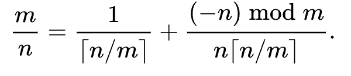

Правильную рациональную дробь можно представить в виде египетской дроби. Дробь 

Реализуйте программу, которая по входной дроби вычисляет знаменатели дробей в египетском представлении

Формат ввода
Два целых числа 
0<M<N

Формат вывода
Целые числа больше нуля в порядке возрастания, которые составляют знаменатели дроби в египетском представлении

При печати последний элемент выводится без пробела

---

В городе N. введена каноническая денежная система, в которой есть купюры 
a
1
,
a
2
,
.
.
.
,
a
k
a 
1
​
 ,a 
2
​
 ,...,a 
k
​
 . Мистер К. пришел в банк за заработной платой. Заработная плата составляет 
M
M. Мистер К. хотел бы получить заработную плату наименьшим количеством купюр. Ваша цель определить наименьшее количество купюр, которое в сумме дает 
M
M. Количество купюр каждого номинала не ограничено

Формат ввода
На вход подаются числа:

k
k -- количество купюр разного номинала
a
k
a 
k
​
  -- номинал купюр в порядке возрастания
M
M -- сумма, которую получил мистер К.
Формат вывода
Целое число -- наименьшее количество купюр, которое получит мистер К.