# Данный свыше код

## Замер времени
Чтобы произвести замер времени можно воспользоваться следующим кодом:

```cpp
#include <iostream>
#include <chrono>

void func() {
    std::cout << "Hello_world" << '\r';
}

int main() {
    auto begin = std::chrono::steady_clock::now();
    for (unsigned cnt = 100000; cnt != 0; --cnt)
        func();
    auto end = std::chrono::steady_clock::now();
    auto time_span = std::chrono::duration_cast<std::chrono::milliseconds>(end - begin);
    std::cout << "\n\n";
    std::cout << time_span.count() << std::endl;
    return 0;
}
```

## Выбор случайного числа

Чтобы выбрать случайное целое число в заданном диапазоне можно воспользоваться следующим кодом:

```cpp
#include <iostream>
#include <random>

int main() {
    int arr[] = {1, 2, 3, 4, 5, 6, 7, 8, 9, 0};
    unsigned seed = 1001;
    std::default_random_engine rng(seed);
    std::uniform_int_distribution<unsigned> dstr(0,9);
    for (unsigned counter = 100; counter != 0; --counter)
        std::cout << arr[ dstr( rng ) ] << '\n';
    std::cout << std::endl;
    return 0;
}
```

# Условие

**Задача:** проверить прямыми измерениями времени асимптотическую сложность алгоритмов по времени в зависимости от объёма данных.

## Поиск (3 - 5)

1. Напишите две функции поиска значения в массиве целых чисел (тип int): 
    - функцию поиска полным перебором для массива с произвольными данными и 
    - функцию бинарного поиска для упорядоченного массива. 

2. Убедитесь прямыми измерениями времени, что для функции с полным перебором время растёт **линейно** с объёмом данных, а для функции бинарного поиска - **логарифмически**. 

Следует учесть, что время одного запуска функции может быть небольшим и может зависеть от планировщика операционной системы. Необходимо для заданного числа элементов в массиве произвести *множество запусков* и измерить *общее время*. 

Для того, чтобы измерить время **наихудшего** случая, необходимо всегда выбирать значение, которое не содержится в массиве. 
Для проверки **среднего** случая можно многократно запустить функцию, выбирая элемент случайным образом.

## Сумма двух (6 - 7)

В массиве требуется найти два различных элемента, которые в сумме дают заданное число, либо указать, что такой пары нет. 

1. Подтвердите прямыми измерениями, что алгоритм полного перебора имеет квадратичную асимптотическую сложность от N, количества элементов в массиве (O(N²)). 

2. Для упорядоченного массива существует алгоритм, который работает с линейной асимптотикой. Реализуйте этот алгоритм и подтвердите асимптотику прямыми измерениями.

## Часто используемый элемент (8 - 10)

В первой задаче мы подразумевали, что при поиске мы в качестве ключа передаём произвольные элементы. Однако, часто в жизни данные оказываются не случайные и не которые элементы мы ищем чаще других. Попытаемся оптимизировать наш массив для таких случаев. Если в массиве при поиске мы находим некоторый элемент, то будем продвигать его ближе к началу, чтобы при следующем поиске найти быстрее. Рассмотрим три стратегии.

    Стратегия А: если мы нашли в массиве некоторый элемент и он не является первым, то обмениваем его с первым элементом.
---
    Стратегия В: если мы нашли в массиве некоторый элемент и он не является первым, то переставим его с левым соседом, элементом с индексом на единицу меньше.
---
    Стратегия С: если мы нашли в массиве некоторый элемент, то увеличим счётчик успешных поисков этого элемента (для этого нам потребуется дополнительный массив счётчиков), если элемент не первый и его счётчик превышает счётчик элемента слева, то поменяем их местами.

> Во всех трёх стратегиях ничего не предпринимаем, если элемент в массиве не найден.

Проверьте прямыми измерениями времени:

1. изменится ли асимптотика поиска, если при поиске запросы будут равномерно распределены по множеству значений, включая неудачный поиск (нет такого элемента);

2. изменится ли асимптотика поиска, если распределение неравномерно (какие-то данные при поиске встречаются гораздо чаще);

3. есть ли различия в асимптотической сложности этих стратегий при равномерном и неравновероятном распределении данных. 

# Работа

Работа проводиться для массивов, память для которых выделяется отдельно (в куче), т.к. в дальнейшем автору хочется работать с большими наборами данных. При желании можно было работать с массивами в стеке.

## Сохранение в файл
Результатом тестирования работы каждого из алгоритмов будет служить csv таблица следующего вида: 

`test_name.csv`
```test_name.csv
n;      t_ns
100;    20 // аналитически наихудший случай 
100;    11
...
// m+1 результатов для данного N
...
100;    9
1000;   1001
...
1000000;23952
```

Где n - кол-во элементов в массиве, t_ms - время выполнения в ms.

При этом первым для данного n будет записываться результат работы алгоритма в аналитически наихудшем случае, а затем будут идти m результатов работы в случайном случае (если такой анализ необходим).

Запись данных производиться в конце тестирования с помощью функции 
```cpp 
void write_file(int n_values[], double times[], int size, std::string filename)
```

Возможно стоило это делать во время работы, но в рамках данной задачи индиферентно.


## Рассчет времени работы

Для усреднения мы выбираем 2 числа:
- K - число усреднений для 1 и той же операции, т.е. при неизменных входных данных. 
    - Т.к. есть необходимость мнгократных измерений для небольшого кол-ва, а для большого она меньше, мы делим K на число элементов массива ns[i], во время проверки времени работы.
    - Для третьей части работы число K использовалось как число операций над одним и тем же массивом. Соответсвеннно таким образом мы получали среднее время работы алгоритма при K различных запросах, а не K запросах при одинаковых начальных условиях.
- M - число измерений, для случайных входных данных (т.е. кол-во раз генерации различных массивов с данными.)

Которые можно задать при компиляции программы c помощью `-Wvla -DM=10 -DK=100`
В дальнейшем при построении графика, будем использовать отображение `boxplot` где наихудший случай должен (возможно не всегда) отображаться верхней точкой вне квартилей.

# Результаты
*Note:* Для удобства восприятия, я убрал заглавные комментарии из кода внутри функций в рамках данного текста.
## Поиск
### Линейный
#### Реализация функции
```cpp
int find_num_in_array(int *array, int n, int num) {
    int idx_n = -1;
    for (int idx = 0; idx < n; ++idx) {
        if (num == array[idx]) {
            idx_n = idx;
            break;
        }
    }
    return idx_n;
}
```
#### Реализация тестирования времени работы
```cpp

void time_test_find_num_in_array(int ns[], int size_ns, int m, unsigned seed) {
    std::default_random_engine rng(seed);

    int size = size_ns * (m + 1); // общее количество измерений
    double *times = new double[size];
    int *n_values = new int[size];

    for (int i = 0; i < size_ns; ++i) {
        int *arr = create_random_array(ns[i], rng);

        std::uniform_int_distribution<unsigned> dstr(0, ns[i]-1);

        for (int j = 0; j <= m; ++j) {
            int num;
            if (j == 0) {
                num = ns[i]; // нет в массиве
            } else {
                num = static_cast<int>(dstr(rng));
            }

            // измеряем k раз
            auto begin = std::chrono::steady_clock::now();
            for (int k = 0; k < K/ns[i]; ++k) {
                find_num_in_array(arr, ns[i], num);
            }
            auto end = std::chrono::steady_clock::now();
            auto time_span = std::chrono::duration_cast<std::chrono::nanoseconds>(end - begin);
            
            times[i * (m + 1) + j] = time_span.count()/(K/ns[i]);
            n_values[i * (m + 1) + j] = ns[i];
        }

        delete[] arr;
    }

    write_file(n_values, times, size, "./lab1-cpp/csv/find_num_in_array.csv");

    delete[] times;
    delete[] n_values;
}
```
Из заслуживающих внимани моментов, мы проводим 1 измерение в гарантированно худшем случае. 

При необходимости этот случай можно отдельно сравнивать с усредненным значением, однако отдельно я этого не делал. Примером может служить построенный в будущем график `boxedplot`, где эта точка - наибольшаяя лежащая за пределами доверительного интервала (и отображающаяся кругом).

В дальнейшем код тестирования берется за основу для всех тестирований с неупорядоченным массивом данных.

*Прим.* Незначительное изменения использования K и логики генерации массива с неравномерными вероятностями проводятся в 3 пункте задачи.

#### Графики
Построим график зависимости в обычном масштабе, для анализа общей ассимптотики.
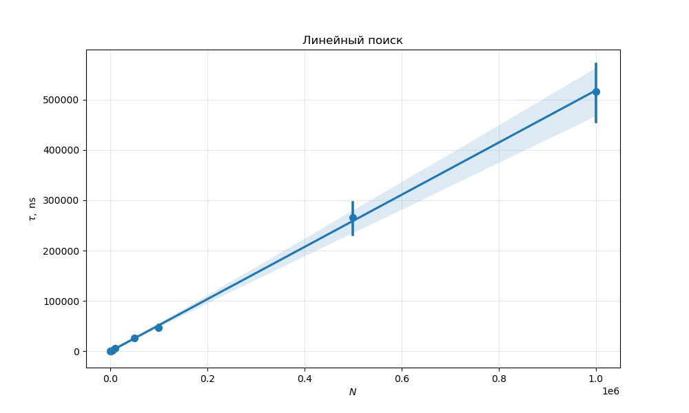
И в логарифмическом, для равномерного отображения точек по N.

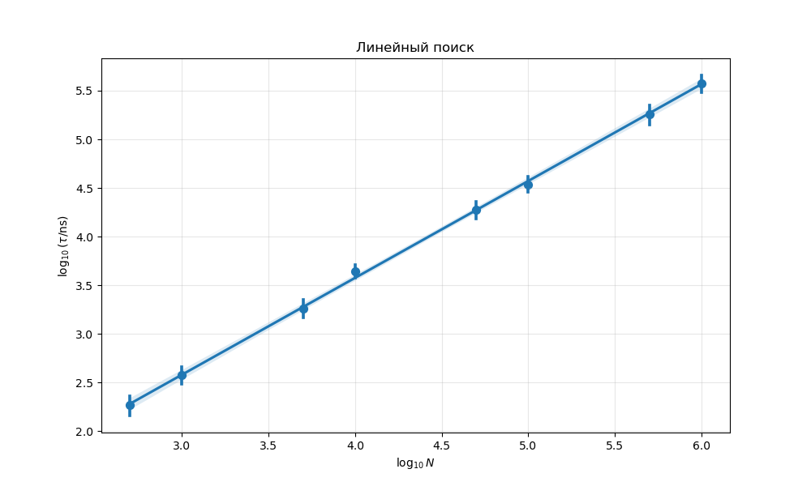

В результате по графику видно, что алгоритм имеет ассимтотическю вычислительную сложность  $\mathcal{\tau = O(n)},\ \tau \to \infty$

### Бинарный (сортированный массив)
#### Реализация фукнции
```cpp
int find_num_in_sorted_array(int *array, int n, int num) {
    int left = 0;
    int right = n - 1;
    
    while (left <= right) {
        int idx = left + (right - left) / 2;
        
        if (array[idx] == num) {
            return idx;
        } else if (array[idx] < num) {
            left = idx + 1;
        } else {
            right = idx - 1;
        }
    }
    
    return -1;
}
```
И функции тестирования
```cpp
void time_test_find_num_in_sorted_array(int ns[], int size_ns, int m, unsigned seed) {
    std::default_random_engine rng(seed);

    int size = size_ns * (m + 1); // общее количество измерений
    double *times = new double[size];
    int *n_values = new int[size];

    for (int i = 0; i < size_ns; ++i) {
        int *arr = create_array(ns[i]); 
        for (int idx = 0; idx < ns[i]; ++idx) {
            arr[idx] = idx + 1; 
        }

        std::uniform_int_distribution<unsigned> dstr(1, ns[i]);

        for (int j = 0; j <= m; ++j) {
            int num;
            if (j == 0) {
                // наихудший случай
                num = 0;
            } else {
                // случайный элемент из массива
                num = static_cast<int>(dstr(rng));
            }

            auto begin = std::chrono::steady_clock::now();
            for (int k = 0; k < (K / ns[i]); ++k) {
                find_num_in_sorted_array(arr, ns[i], num);
            }
            auto end = std::chrono::steady_clock::now();
            auto time_span = std::chrono::duration_cast<std::chrono::nanoseconds>(end - begin);

            times[i * (m + 1) + j] = time_span.count() / static_cast<double>(K / ns[i]); 
            n_values[i * (m + 1) + j] = ns[i];
        }

        delete[] arr;
    }

    write_file(n_values, times, size, "./lab1-cpp/csv/find_num_in_sorted_array.csv");

    delete[] times;
    delete[] n_values;
}
```
Изменением служит отсутвие необходимости в генерации случайного массива, достаточно взять произвольный упорядоченный.

Аналогично в дальнейшем код тестирования берется за основу для всех тестирований с упорядоченным массивом данных.

#### Графики
Пронаблюдаем, что алгоритм имеет вычислительную сложность $\mathcal{O}(\log(n))$
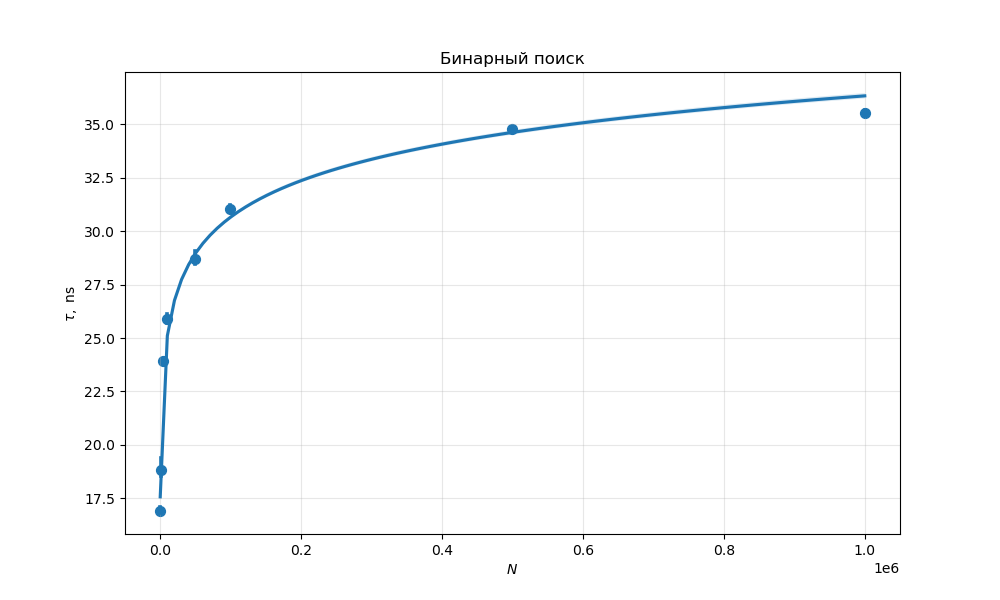

И проведем линеаризацию, построив в логарифмическом масштабе по N
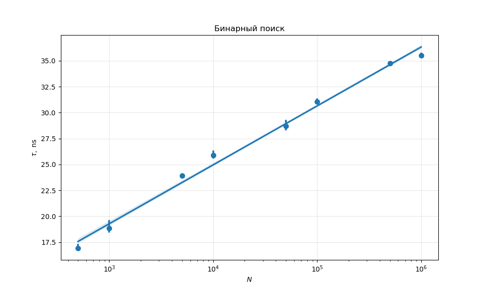 

# Cумма двух
## Полный перебор
### Реализация функции
```cpp
bool find_pair_with_sum(int *array, int n, int sum) {
    
    for (int i=0; i<n; ++i) {
        for (int j=i+1; j<n; ++j) {
            if (array[i]+array[j]==sum) {
                return true;
            }
        }
    }

    return false;
}
```
Функция тестирования не изменена.
### Графики
Алгоритм имеет вычислительную сложность $\mathcal{O}(n^2))$
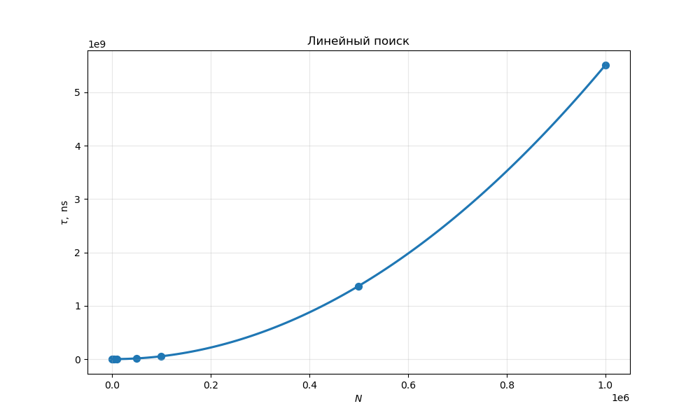
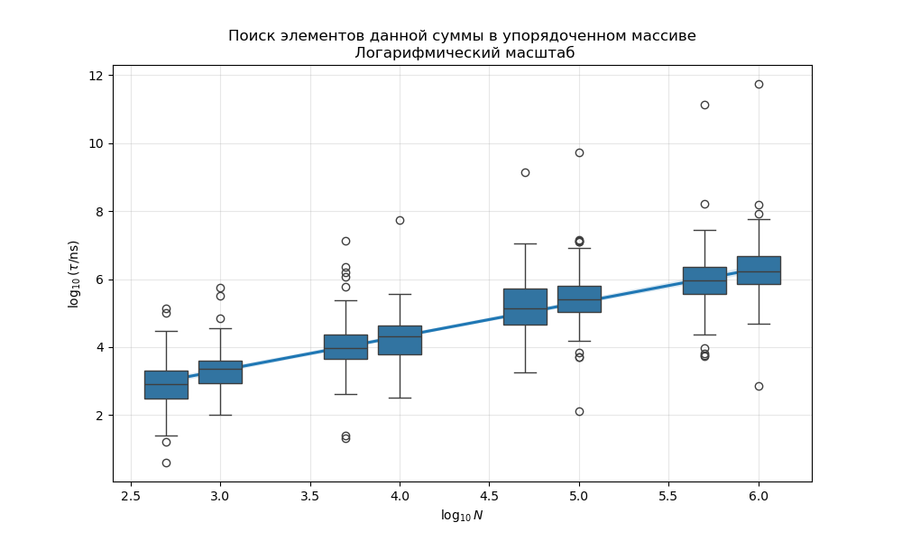 


## Линейный в отсортированном массиве
### Реализация
```cpp
bool find_pair_with_sum_in_sorted_array(int *array, int n, int sum) {
    int left = 0;
    int right = n - 1;
    
    while (left < right) {
        int sum_lr = array[left] + array[right];
        
        if (sum_lr == sum) {
            return true;
        } else if (sum_lr < sum) {
            left++;
        } else {
            right--;
        }
    }
    
    return false;
}
```
### Графики
Алгоритм имеет вычислительную сложность $\mathcal{O}(n))$
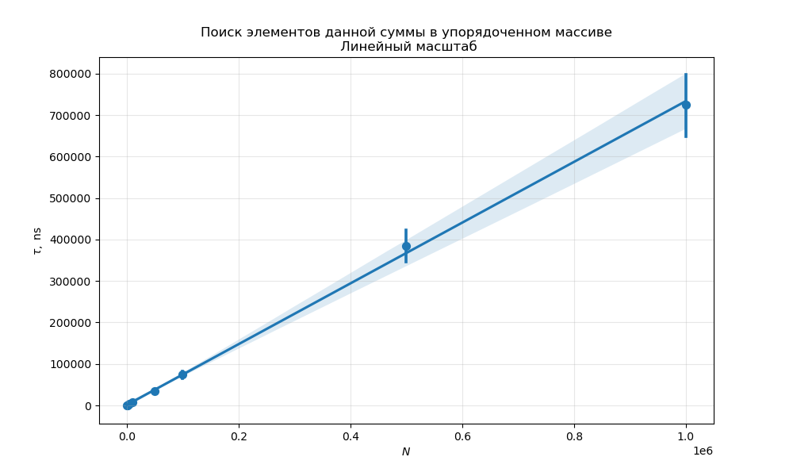 

`boxedplot` для анализа статистики подробнее, чем доверительный интервал в `regplot`

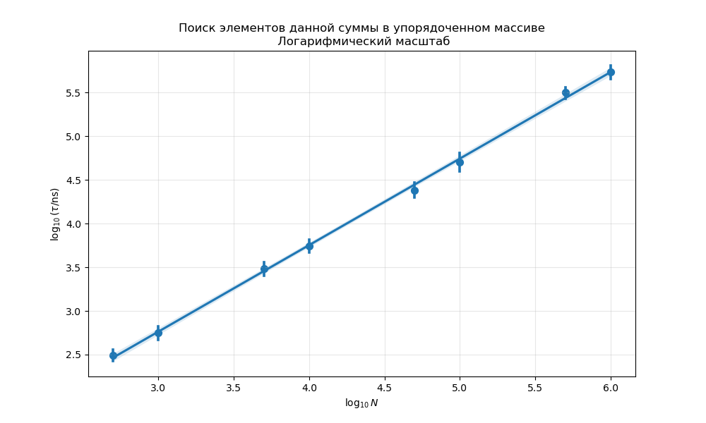

# Часто используемый элемент
## Реализация find_X
### find_A
```cpp
bool find_A (int *array, int n, int num, int *counter) {
    // int num_idx = -1;
    for (int idx = 0; idx < n; ++idx) {
        if (num == array[idx]) {
            // num_idx = idx;
            if (idx>=1) {
                swap(array[0], array[idx]);
            }
            return true;
            break; //по сути не нужно
        }
    }
    return false;
}
```
### find_B
```cpp

bool find_B (int *array, int n, int num, int *counter) {
    // int num_idx = -1;
    for (int idx = 0; idx < n; ++idx) {
        if (num == array[idx]) {
            // num_idx = idx;
            if (idx>=1) {
                swap(array[idx-1], array[idx]);
            } 
            return true;
            break;
        }
    }
    return false;
}
```

### find_C
```cpp
bool find_C (int *array, int n, int num,  int *counter) {
    // int num_idx = -1;
    for (int idx = 0; idx < n; ++idx) {
        if (num == array[idx]) {
            // num_idx = idx;
            counter[idx] += 1; 
            if (idx>=1 and counter[idx-1] < counter[idx]) {
                swap(array[idx-1], array[idx]);
                swap(counter[idx-1], counter[idx]);
            } 
            return true;
            break;
        }
    }
    return false;
}
```
Стоит отметить, что для удобства тестирования, сигнатура `find_X` включают `*counter`, который используется только в функции `find_C`.
## Функция тестирования
Было произведено обобщение функции тестирования, которая использовалась в самом начале.
Ключевые изменения касаются следующего:
- Функция тестирования принимает в качестве аргумента функцию поиска find_X. Что позволяет нам единообразно тестировать все методы.
- Для генерации случайного числа со смещенной вероятностью, мы применяем композицию стандартной и непрерывного преобразования, отличного от тождественнойго: $f_{\text{transform}}:\ [0, n-1] \to [0, n-1] $. 
```cpp
int * create_random_array_with_transformed_uniform(int n, std::default_random_engine& rng, int (* transform)(int, int)) {
    int * array = new int[n];
    std::uniform_int_distribution<unsigned> dstr(0, n-1);
    for (int idx = 0; idx < n; ++idx){
        array[idx] = transform(dstr(rng), n);
    }
    return array;
}
```
*Note:* преобразование отображает диапазон чисел сам в себя.

Реализованы функции тождественного и параболического преобразования. Второе смещает вероятность в сторону меньших чисел.
```cpp
int parabolic_transform(int x, int n) {
    return static_cast<int>((n - 1) - (static_cast<double>(x) * x) / (n - 1));
}

int id_transform(int x, int n) {
    return x;
}
```

Таким образом итоговая фукнция тестирования:
```cpp
void time_test (int ns[], 
        int size_ns, 
        int m, 
        unsigned seed, 
        bool find_X(int*, int, int, int*), 
        bool data_uniform,
        bool request_uniform,
        string file_name) 
{    
    std::default_random_engine rng(seed);

    int size = size_ns * (m + 1); // общее количество измерений
    double *times = new double[size];
    int *n_values = new int[size];
    

    for (int i = 0; i < size_ns; ++i) {
        std::cout << '\n' << "n=" << ns[i] << std::endl;
        // (не)равномерное распределение данных, по которым ведется поиск 
        int *arr = nullptr;
        if (data_uniform) {
            arr = create_random_array_with_transformed_uniform(ns[i], rng, id_transform);
        } else {
            arr = create_random_array_with_transformed_uniform(ns[i], rng, parabolic_transform);
        }
        
        int *counter = new int[ns[i]]{}; 

        std::uniform_int_distribution<unsigned> dstr(0, ns[i]-1);

        for (int j = 0; j <= m; ++j) {
            if (j%(m/10)==0) {
                std::cout << static_cast<int>(static_cast<double>(j)/m*1*10);;
            }
            
            // измеряем k раз, но теперь для различных входных значений
            // т.е. не рассматриваем влияние вариаций из-за планировщика ОС
            auto begin = std::chrono::steady_clock::now();

            for (int k = 0; k < K; ++k) {
                int num;

                if (request_uniform) {
                    num = id_transform(static_cast<int>(dstr(rng)), ns[i]); //равномерные запросы
                } else {
                    num = parabolic_transform(static_cast<int>(dstr(rng)), ns[i]); //неравномерные
                }

                find_X(arr, ns[i], num, counter);
            }
            auto end = std::chrono::steady_clock::now();
            auto time_span = std::chrono::duration_cast<std::chrono::nanoseconds>(end - begin);
            
            times[i * (m + 1) + j] = time_span.count()/(K);
            n_values[i * (m + 1) + j] = ns[i];
        }
        delete[] arr;
        delete[] counter;
    }

    write_file(n_values, times, size, "./lab1-cpp/csv/"+file_name);

    delete[] times;
    delete[] n_values;
}
```


Теперь можем провести анализ результатов.
## Равномерные данные и запросы (11)
Сначала проведем тестирование аналогичное первому пункту для всех функций.
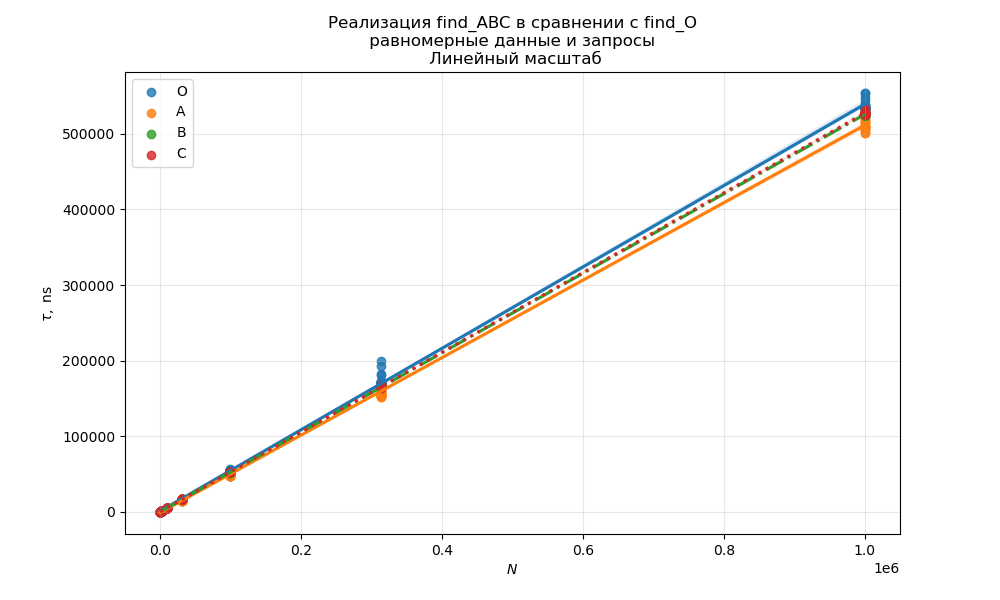

Сдесь для промежуточных значений массивов были выбраны первые значащие цифры числа пи, т.к. $\pi^2 \approx 10$, что позволяет получить равномерные измерения в логаримическом масштабе:
 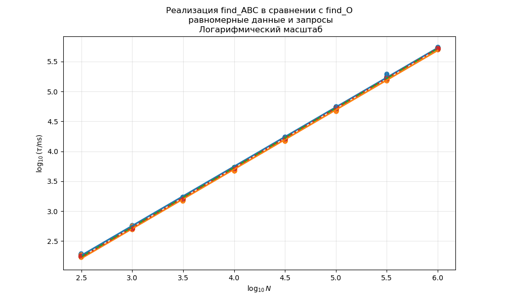

<!-- Также в дальнейшем будем сравнивать время функций ABC и O, вычитая время первых из стандартного линейного поиска:
 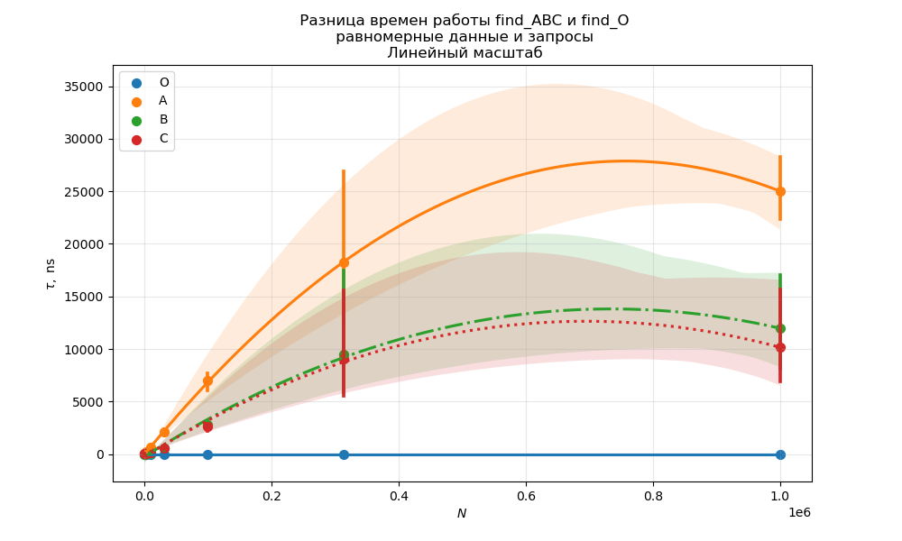  -->

Видно, что в данном случае сратегии не дают никакого преимущества

## Неравномерные запросы (10)
Аналогично строим графики для случаев, кодгда наши запросы неравномерны:
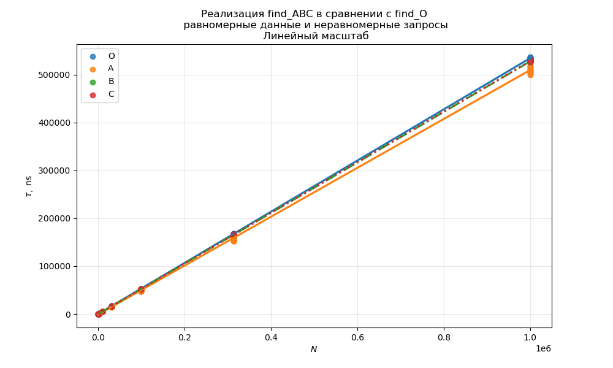
 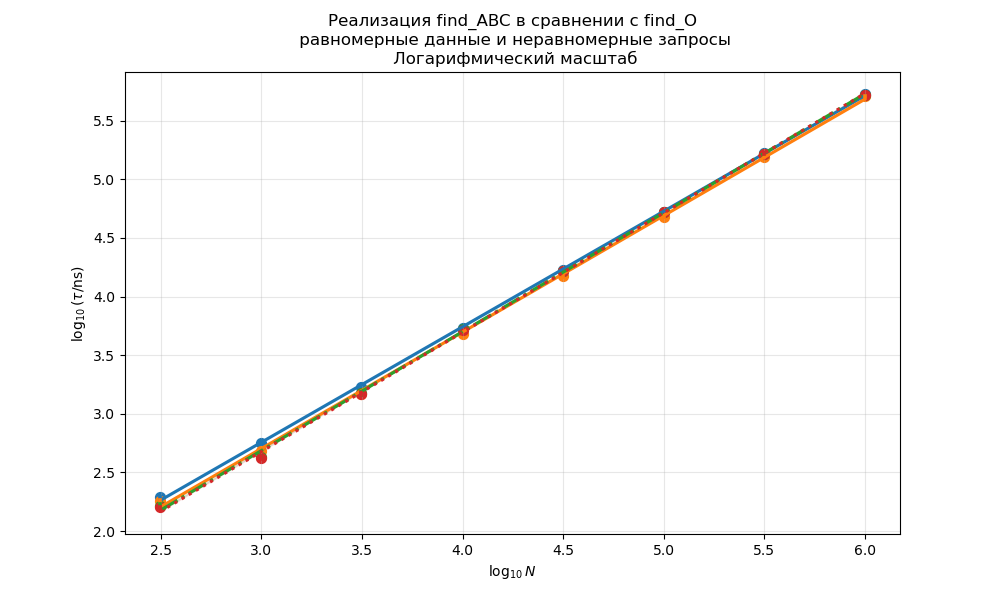

 Также сравним время функций ABC и O, вычитая время первых из стандартного линейного поиска:
 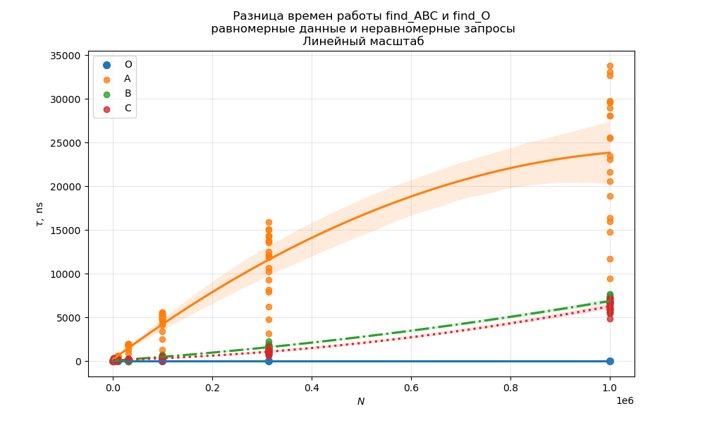 

Мы видим что различие становиться значимым для большего кол-ва массивов. Это объясняется тем, что стратегии оптимизируют расстановку элементов в течении первых запросов, и в дальнейшем запросы становятсясогласованы по времени поиска. 

**NB:** Мы использовали `K=100'000` в рамках работы с одним массивом. Пэтому для больших N возможно время еще не установилось. Кроме того усреднение времени приходится на все запросы, в том числе начальные, когда разниы между алгоритмами нет.

## Неравномерные данные (01)
Нетрудно заметить, что если неравномерные только данные или только запросы, то эти случаи не различаются между собой. Что подтверждается прямыми измерениями.
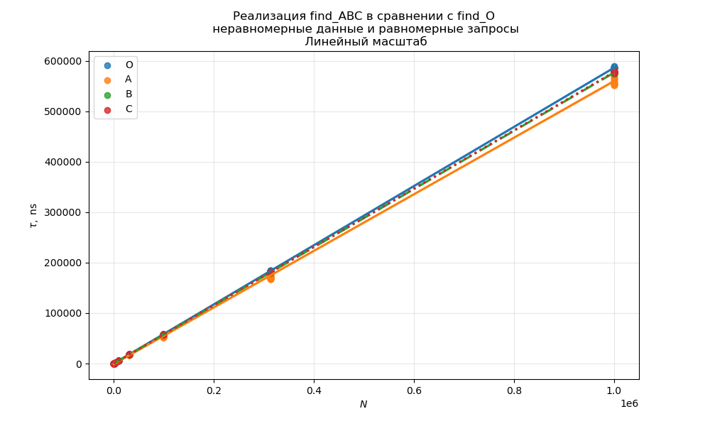
 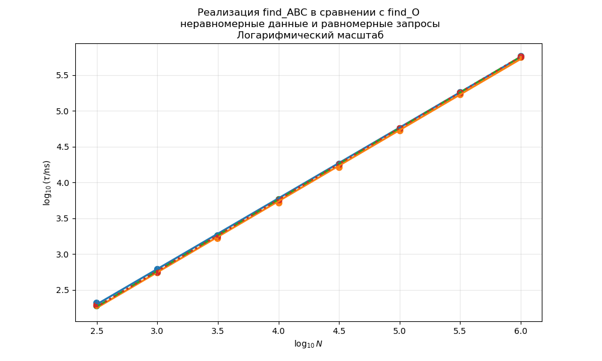
 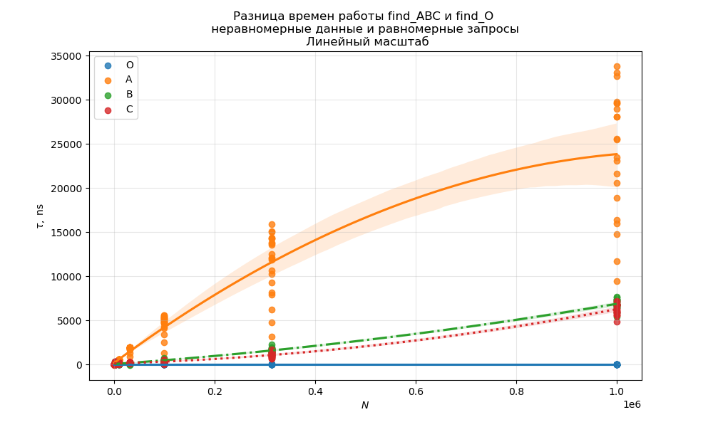 

# Исходные данные и код
Полный код, из которого можно запустить реализованные функции тестирования находится в файле
[stat.cpp](stat.cpp).\
Выходные данные, в виде csv таблиц находятся в папке [csv](csv)

Ноутбук, в котором реализуется построение графиков, преймущественно с помощью `matplotlib` и `sns.regplot`, `sns.boxplot` via `seaborn`, находится в фале [graph.ipynb](python/graph.ipynb).\
Графики хранятся в папке [python](python) вместе с ним.


# Полный код

```cpp
//много букв и исходный код
```

```cpp 
#include <iostream>
#include <random>
#include <chrono>
#include <fstream>
#include <iomanip>
#include <string>

using std::cout;
using std::endl;
using std::string;

// Задаем N - кол-во элементов в массиве, при компиляции 
// постфактум не используется
#ifndef N
#define N 10
#endif
// Задаем M - кол-во повторений для усреднения
#ifndef M
#define M 20
#endif
// Задаем K - кол-во повторений для усреднения одного измерения 
// (затем в коде нормируем на размер массива, чтобы быстрее работало)
// нивелирует очередь в планировщике ОС
#ifndef K
#define K 100000
#endif

// Предварительные объявления функций (убраны const)
int * create_array(int n=N);
int * create_random_array(int n, std::default_random_engine& rng);
int find_num_in_array(int *array, int n, int num);
int find_num_in_sorted_array(int *array, int n, int num);
void time_test_find_num_in_array(int ns[], int size_ns, int m, unsigned seed);
void time_test_find_num_in_sorted_array(int ns[], int size_ns, int m, unsigned seed);
void write_file(int n_values[], double times[], int size, std::string filename);

bool find_pair_with_sum(int *array, int n, int sum);
bool find_pair_with_sum_in_sorted_array(int *array, int n, int sum);
void time_test_find_pair_with_sum(int ns[], int size_ns, int m, unsigned seed);
void time_test_find_pair_with_sum_in_sorted_array(int ns[], int size_ns, int m, unsigned seed);

bool find_O (int *array, int n, int num, int *counter=nullptr);
bool find_A (int *array, int n, int num, int *counter=nullptr);
bool find_B (int *array, int n, int num, int *counter=nullptr);
bool find_C (int *array, int n, int num, int *counter=nullptr);

int parabolic_transform(int x, int n);
int id_transform(int x, int n);
int * create_random_array_with_transformed_uniform(int n, std::default_random_engine& rng, int (* transform)(int, int));

void time_test (int ns[], 
        int size_ns, 
        int m, 
        unsigned seed, 
        bool find_X(int*, int, int, int*), 
        bool data_uniform = true,
        bool request_uniform = true,
        string file_name = "time_test_1_example.csv");


/*****************************************************************************************************/
int main() {
    int ns[8] = {314, 1000, 3141, 10000, 31415, 100000, 314159, 1000000}; // измеряемые длины массивов
    int size_ns = 8;
    unsigned seed = 52;

    // поиск числа
    // time_test_find_num_in_array(ns, size_ns, M, seed);
    // time_test_find_num_in_sorted_array(ns, size_ns, M, seed);

    // поиск суммы
    // time_test_find_pair_with_sum(ns, size_ns, M, seed);
    // time_test_find_pair_with_sum_in_sorted_array(ns, size_ns, M, seed);
    
    //1
    time_test (ns, size_ns, M, seed, find_O, true, true, "O11.csv");
    time_test (ns, size_ns, M, seed, find_A, true, true, "A11.csv");
    time_test (ns, size_ns, M, seed, find_B, true, true, "B11.csv");
    time_test (ns, size_ns, M, seed, find_C, true, true, "C11.csv");

    //2
    time_test (ns, size_ns, M, seed, find_O, true, false, "O10.csv");
    time_test (ns, size_ns, M, seed, find_A, true, false, "A10.csv");
    time_test (ns, size_ns, M, seed, find_B, true, false, "B10.csv");
    time_test (ns, size_ns, M, seed, find_C, true, false, "C10.csv");

    //3
    time_test (ns, size_ns, M, seed, find_O, false, true, "O01.csv");
    time_test (ns, size_ns, M, seed, find_A, false, true, "A01.csv");
    time_test (ns, size_ns, M, seed, find_B, false, true, "B01.csv");
    time_test (ns, size_ns, M, seed, find_C, false, true, "C01.csv");

    //false, false - возвращает равномерное распределение запросов по данным
    return 0;
}

void swap(int& lhv, int& rhv){
    int tmp = lhv;
    lhv = rhv;
    rhv = tmp;
}

int * create_random_array(int n, std::default_random_engine& rng) {
    int * array = new int[n];
    std::uniform_int_distribution<unsigned> dstr(0, n-1);
    for (int idx = 0; idx < n; ++idx){
        array[idx] = dstr(rng);
    }
    return array;
}

int * create_array(int n) {
    int * array = new int[n];
    return array;
}

int find_num_in_array(int *array, int n, int num) {
    /* реализует алгоритм линейного поиска
       принимает на вход число num и массив array размера n
       возвращает индекс первого вхождения элемента num 
       если не найден - возвращает -1 */
    int idx_n = -1;
    for (int idx = 0; idx < n; ++idx) {
        if (num == array[idx]) {
            idx_n = idx;
            break;
        }
    }
    return idx_n;
}

int find_num_in_sorted_array(int *array, int n, int num) {
    /* Реализует алгоритм бинарного поиска
       принимает на вход число num и сортированный массив array размера n
       возвращает индекс первого вхождения элемента num,
       если не найден - возвращает -1 */
    int left = 0;
    int right = n - 1;
    
    while (left <= right) {
        int idx = left + (right - left) / 2;
        
        if (array[idx] == num) {
            return idx;
        } else if (array[idx] < num) {
            left = idx + 1;
        } else {
            right = idx - 1;
        }
    }
    
    return -1;
}

void time_test_find_num_in_array(int ns[], int size_ns, int m, unsigned seed) {
    // реализует тестирование времени работы функции линейного поиска и сохраняет результаты в файл
    std::default_random_engine rng(seed);

    int size = size_ns * (m + 1); // общее количество измерений
    double *times = new double[size];
    int *n_values = new int[size];

    for (int i = 0; i < size_ns; ++i) {
        int *arr = create_random_array(ns[i], rng);

        std::uniform_int_distribution<unsigned> dstr(0, ns[i]-1);

        for (int j = 0; j <= m; ++j) {
            int num;
            if (j == 0) {
                num = ns[i]; // нет в массиве
            } else {
                num = static_cast<int>(dstr(rng));
            }

            // измеряем k раз
            auto begin = std::chrono::steady_clock::now();
            for (int k = 0; k < K/ns[i]; ++k) {
                find_num_in_array(arr, ns[i], num);
            }
            auto end = std::chrono::steady_clock::now();
            auto time_span = std::chrono::duration_cast<std::chrono::nanoseconds>(end - begin);
            
            times[i * (m + 1) + j] = time_span.count()/(K/ns[i]);
            n_values[i * (m + 1) + j] = ns[i];
        }

        delete[] arr;
    }

    write_file(n_values, times, size, "./lab1-cpp/csv/find_num_in_array.csv");

    delete[] times;
    delete[] n_values;
}

void time_test_find_num_in_sorted_array(int ns[], int size_ns, int m, unsigned seed) {
    // реализует тестирование времени работы бинарного поиска в упорядоченном массиве
    std::default_random_engine rng(seed);

    int size = size_ns * (m + 1); // общее количество измерений
    double *times = new double[size];
    int *n_values = new int[size];

    for (int i = 0; i < size_ns; ++i) {
        int *arr = create_array(ns[i]); 
        for (int idx = 0; idx < ns[i]; ++idx) {
            arr[idx] = idx + 1; 
        }

        std::uniform_int_distribution<unsigned> dstr(1, ns[i]);

        for (int j = 0; j <= m; ++j) {
            int num;
            if (j == 0) {
                // наихудший случай
                num = 0;
            } else {
                // случайный элемент из массива
                num = static_cast<int>(dstr(rng));
            }

            auto begin = std::chrono::steady_clock::now();
            for (int k = 0; k < (K / ns[i]); ++k) {
                find_num_in_sorted_array(arr, ns[i], num);
            }
            auto end = std::chrono::steady_clock::now();
            auto time_span = std::chrono::duration_cast<std::chrono::nanoseconds>(end - begin);

            times[i * (m + 1) + j] = time_span.count() / static_cast<double>(K / ns[i]); 
            n_values[i * (m + 1) + j] = ns[i];
        }

        delete[] arr;
    }

    write_file(n_values, times, size, "./lab1-cpp/csv/find_num_in_sorted_array.csv");

    delete[] times;
    delete[] n_values;
}

void write_file(int n_values[], double times[], int size, std::string filename) {
    /*
    функция записи данных в filename.csv в заданном формате:
    n;      t_ns
    100;    52.523e0
    ...
    */ 
    std::ofstream file(filename);

    if (!file.is_open()) {
        std::cerr << "Ошибка открытия файла\n";
        return;
    }

    file << "n;t_ns\n";

    // форматный вывод
    file << std::scientific << std::setprecision(3);

    for (int i = 0; i < size; ++i) {
        file << n_values[i] << ";" << times[i] << "\n";
    }

    file.close();
}

// если хотим возвращать индексы:
// bool find_pair_with_sum(int *array, int n, int sum, int &i, int &j) 
// записываем в i, j
bool find_pair_with_sum(int *array, int n, int sum) {
    /*
    рефлизует нахождение элементов, 
    сумма которых равна заданной
    методом полного перебора
    */
    
    for (int i=0; i<n; ++i) {
        for (int j=i+1; j<n; ++j) {
            if (array[i]+array[j]==sum) {
                return true;
            }
        }
    }

    return false;
}

bool find_pair_with_sum_in_sorted_array(int *array, int n, int sum) {
    /*
    рефлизует нахождение элементов 
    отсортированного массива, 
    сумма которых равна заданной
    */
    int left = 0;
    int right = n - 1;
    
    while (left < right) {
        int sum_lr = array[left] + array[right];
        
        if (sum_lr == sum) {
            return true;
        } else if (sum_lr < sum) {
            left++;
        } else {
            right--;
        }
    }
    
    return false;
}

void time_test_find_pair_with_sum(int ns[], int size_ns, int m, unsigned seed) {
    // реализует тестирование времени работы функции линейного поиска и сохраняет результаты в файл
    std::default_random_engine rng(seed);

    int size = size_ns * (m + 1); // общее количество измерений
    double *times = new double[size];
    int *n_values = new int[size];

    for (int i = 0; i < size_ns; ++i) {
        int *arr = create_random_array(ns[i], rng);

        std::uniform_int_distribution<unsigned> dstr(0, ns[i]*2); //*2
        
        std::cout << ns[i] << std::endl;
        for (int j = 0; j <= m; ++j) {
            int sum;
            if (j == 0) {
                sum = -1; // нет отрицательной суммы
            } else {
                sum = static_cast<int>(dstr(rng));
            }

            // измеряем k раз
            auto begin = std::chrono::steady_clock::now();
            for (int k = 0; k < K/ns[i]; ++k) {
                find_pair_with_sum(arr, ns[i], sum);
            }
            auto end = std::chrono::steady_clock::now();
            auto time_span = std::chrono::duration_cast<std::chrono::nanoseconds>(end - begin);
            
            times[i * (m + 1) + j] = time_span.count()/(K/ns[i]);
            n_values[i * (m + 1) + j] = ns[i];
        }

        delete[] arr;
    }

    write_file(n_values, times, size, "./lab1-cpp/csv/find_pair_with_sum.csv");

    delete[] times;
    delete[] n_values;
}

void time_test_find_pair_with_sum_in_sorted_array(int ns[], int size_ns, int m, unsigned seed) {
    // реализует тестирование времени работы полного перебора
    std::default_random_engine rng(seed);

    int size = size_ns * (m + 1); // общее количество измерений
    double *times = new double[size];
    int *n_values = new int[size];

    for (int i = 0; i < size_ns; ++i) {
        int *arr = create_array(ns[i]); 
        for (int idx = 0; idx < ns[i]; ++idx) {
            arr[idx] = idx + 1; 
        }

        std::uniform_int_distribution<unsigned> dstr(1, ns[i]*2);

        std::cout << ns[i] << std::endl;
        for (int j = 0; j <= m; ++j) {
            int sum;
            if (j == 0) {
                // наихудший случай
                sum = -1;
            } else {
                // случайная сумма
                sum = static_cast<int>(dstr(rng));
            }

            auto begin = std::chrono::steady_clock::now();
            for (int k = 0; k < (K / ns[i]); ++k) {
                find_pair_with_sum_in_sorted_array(arr, ns[i], sum);
            }
            auto end = std::chrono::steady_clock::now();
            auto time_span = std::chrono::duration_cast<std::chrono::nanoseconds>(end - begin);

            times[i * (m + 1) + j] = time_span.count() / static_cast<double>(K / ns[i]); 
            n_values[i * (m + 1) + j] = ns[i];
        }

        delete[] arr;
    }

    write_file(n_values, times, size, "./lab1-cpp/csv/find_pair_with_sum_in_sorted_array.csv");

    delete[] times;
    delete[] n_values;
}

bool find_O (int *array, int n, int num, int *counter) {
    // int idx_n = -1;
    for (int idx = 0; idx < n; ++idx) {
        if (num == array[idx]) {
            return true;
            break;
        }
    }
    return false;
}

bool find_A (int *array, int n, int num, int *counter) {
    // int num_idx = -1;
    for (int idx = 0; idx < n; ++idx) {
        if (num == array[idx]) {
            // num_idx = idx;
            if (idx>=1) {
                swap(array[0], array[idx]);
            }
            return true;
            break; //по сути не нужно
        }
    }
    return false;
}

bool find_B (int *array, int n, int num, int *counter) {
    // int num_idx = -1;
    for (int idx = 0; idx < n; ++idx) {
        if (num == array[idx]) {
            // num_idx = idx;
            if (idx>=1) {
                swap(array[idx-1], array[idx]);
            } 
            return true;
            break;
        }
    }
    return false;
}

bool find_C (int *array, int n, int num,  int *counter) {
    // int num_idx = -1;
    for (int idx = 0; idx < n; ++idx) {
        if (num == array[idx]) {
            // num_idx = idx;
            counter[idx] += 1; 
            if (idx>=1 and counter[idx-1] < counter[idx]) {
                swap(array[idx-1], array[idx]);
                swap(counter[idx-1], counter[idx]);
            } 
            return true;
            break;
        }
    }
    return false;
}


int parabolic_transform(int x, int n) {
    /* x - равномерно-случайное число от 0 до n-1
    применяя неравномерное преобразование к функции распределения,
    получим неравномерное распределение

    используется фиксированная на концах парабола, 
    x: [0, n-1] |--> [0, n-1]
    распределение смещено к 0
    */

    return static_cast<int>((n - 1) - (static_cast<double>(x) * x) / (n - 1));


}

int id_transform(int x, int n) {
    return x;
}

int * create_random_array_with_transformed_uniform(int n, std::default_random_engine& rng, int (* transform)(int, int)) {
    int * array = new int[n];
    std::uniform_int_distribution<unsigned> dstr(0, n-1);
    for (int idx = 0; idx < n; ++idx){
        array[idx] = transform(dstr(rng), n);
    }
    return array;
}

void time_test (int ns[], 
        int size_ns, 
        int m, 
        unsigned seed, 
        bool find_X(int*, int, int, int*), 
        bool data_uniform,
        bool request_uniform,
        string file_name) 
{
    /* 
    реализует тестирование времени работы функции оптимизированнного поиска
    в качестве одного из аргументов принимает саму функцию поиска из A, B, C
    Для удобства, в сигнатуре find_AB также как в find_C ввели массив counter
    
    реализация полностью аналогично тестированию для линейного поиска, 
    поэтому можно использовать результаты оттуда для сравнения
    */

    
    std::default_random_engine rng(seed);

    int size = size_ns * (m + 1); // общее количество измерений
    double *times = new double[size];
    int *n_values = new int[size];
    

    for (int i = 0; i < size_ns; ++i) {
        std::cout << '\n' << "n=" << ns[i] << std::endl;
        // (не)равномерное распределение данных, по которым ведется поиск 
        int *arr = nullptr;
        if (data_uniform) {
            arr = create_random_array_with_transformed_uniform(ns[i], rng, id_transform);
        } else {
            arr = create_random_array_with_transformed_uniform(ns[i], rng, parabolic_transform);
        }
        
        int *counter = new int[ns[i]]{}; 

        std::uniform_int_distribution<unsigned> dstr(0, ns[i]-1);

        for (int j = 0; j <= m; ++j) {
            if (j%(m/10)==0) {
                std::cout << static_cast<int>(static_cast<double>(j)/m*1*10);;
            }
            
            // измеряем k раз, но теперь для различных входных значений
            // т.е. не рассматриваем влияние вариаций из-за планировщика ОС
            auto begin = std::chrono::steady_clock::now();

            for (int k = 0; k < K; ++k) {
                int num;

                if (request_uniform) {
                    num = id_transform(static_cast<int>(dstr(rng)), ns[i]); //равномерные запросы
                } else {
                    num = parabolic_transform(static_cast<int>(dstr(rng)), ns[i]); //неравномерные
                }

                find_X(arr, ns[i], num, counter);
            }
            auto end = std::chrono::steady_clock::now();
            auto time_span = std::chrono::duration_cast<std::chrono::nanoseconds>(end - begin);
            
            times[i * (m + 1) + j] = time_span.count()/(K);
            n_values[i * (m + 1) + j] = ns[i];
        }
        delete[] arr;
        delete[] counter;
    }

    write_file(n_values, times, size, "./lab1-cpp/csv/"+file_name);

    delete[] times;
    delete[] n_values;
}

```

